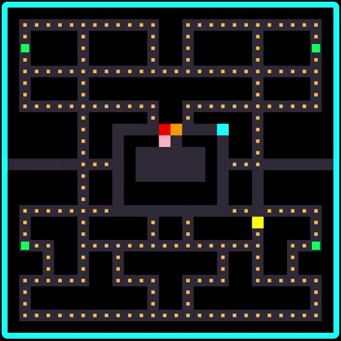

# Pacman: A Coding Hackathon Project

Dive into some nostaglia and play a classic game of Pacman! This project was created for fun during a week-long [Mintbean] (https://mintbean.io/) Hackathon event.

## Technologies Used

- HTML5
- CSS3
- JavaScript (ES6)
- React
- Git

## Try it out!

[Live site here] (https://powerful-falls-77085.herokuapp.com/)
